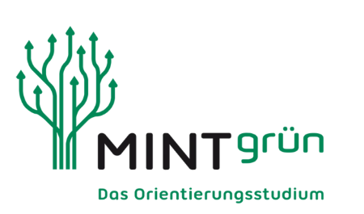
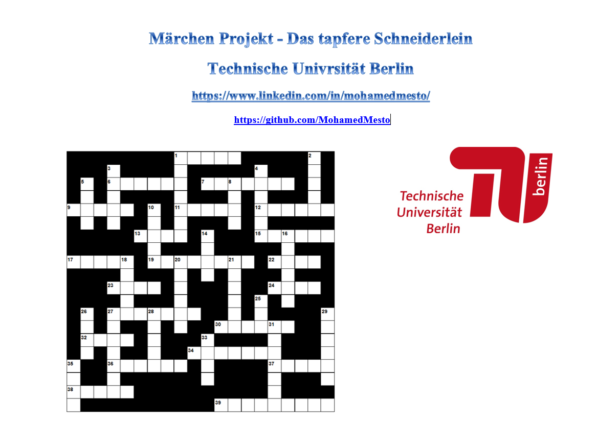

<table border=0>
<tr border=0>
<td>  </td>
  <td align="center"> <h5><a href="https://www.fokus.fraunhofer.de/en">by MINTgrün pre-study orientation program</a></h5> </td>
  <td>  </td>
</tr>
<tr border=0>
<td> </td><td  align="center">Web Technologies   <h5> App Topic </h5> </td><td> </td>
</tr>
<tr border=0>
<td> </td><td> </td><td> </td>
</tr>
  <tr>
    <td> </td>
<td align="center"><h5><a href="">"Schneiderlein Crossword"</a></h5></td>
    <td> </td>
</tr>
  <tr>
    <td> </td>  <td align="center"></td>
    <td> </td>
</tr>
</table>

# Schneiderlein Crossword
Schneiderlein Crossword at Technical University of Berlin - MINT: MINTgrün pre-study orientation program

## Abstract

 
## Tech
DreamWaver, HTML, CSS and JS (internal)
 

